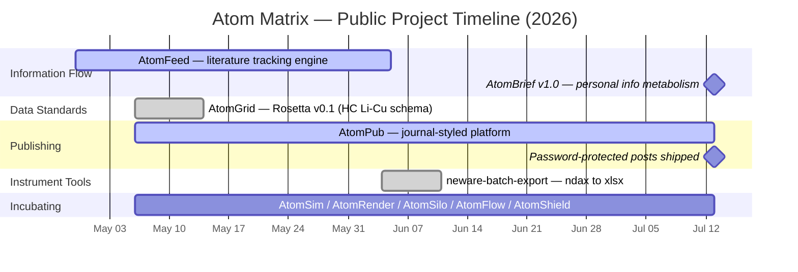

## AtomRearch 🔋

Battery materials · Data-driven electrochemistry · AI for energy storage  

---

### Open-source Projects

**🛠️ [neware-batch-export](https://github.com/AtomRearch/neware-batch-export)**  
Batch-export Neware `.ndax` files to full 8-sheet `.xlsx` — solves the data truncation problem in BTS built-in batch export. Designed for building ML-ready battery datasets at scale.

**🎨 [AtomSketch](https://github.com/AtomRearch/AtomSketch)**  
Publication-quality matplotlib styling for battery research figures. One file, drop it into Claude / Cursor / Copilot — every plot comes out *Nature*/*Science* ready.

**📝 [AtomPub](https://github.com/AtomRearch/AtomPub)**  
A journal-styled academic writing platform for op-eds, method write-ups, reading notes, and data notes. Permanent URLs, citable IDs, open contributions.

**🧠 [AtomBrief](https://github.com/AtomRearch/AtomBrief)**  
Personal information metabolism: RSS capture → keyword hard-filter → AI distillation into knowledge atoms → auto-built weekly report site. What you missed is what you didn't need.

**🗂️ [AtomGrid](https://github.com/AtomRearch/AtomGrid)**  
Rosetta v0.1 — a machine-readable JSON Schema for Li–Cu half-cell cycling data, with browser validator. Battery data standardization as infrastructure.

---

### Project Timeline

Bars span first commit → latest push. Incubating repos hold roadmap READMEs; code lands after internal validation. [AtomFeed](https://github.com/eRearch/AtomFeed) lives on the founder's account with its [product page](https://erearch.github.io/AtomFeed/).

---

### Research Focus

- Lithium metal anodes · solid-state electrolytes
- High-entropy electrode materials
- ...

---

